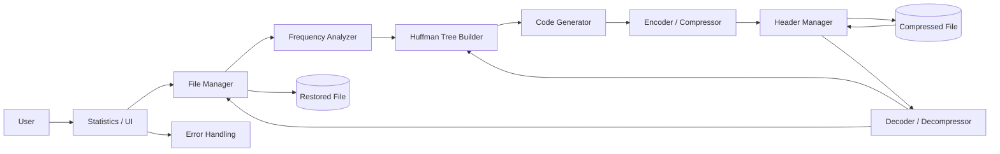
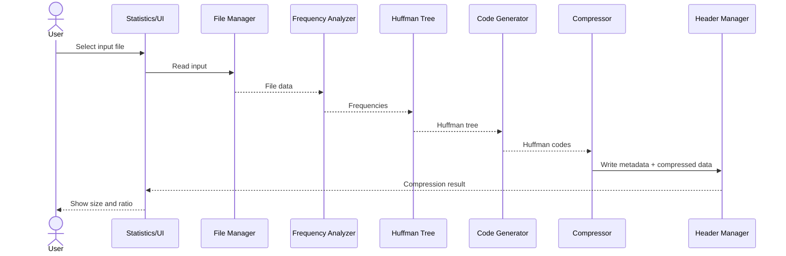
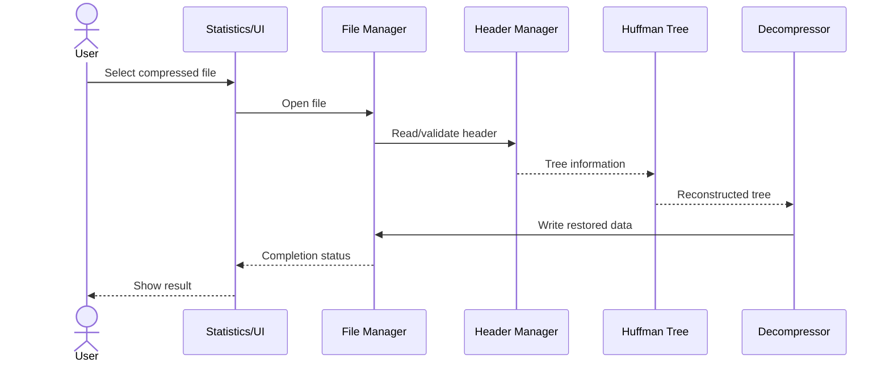

# Software Architecture and Design Specification — Problem 17

**Project:** File Compression Tool
**Group:** 15
**Language:** C / C++
**Core algorithm:** Huffman Coding
**Version:** 1.0

## 1. Introduction
### Purpose
Defines the architecture and design of the basic Huffman-based file compression and decompression tool.

### Scope
Covers file I/O, frequency calculation, Huffman tree construction, code generation, encoding, compressed-file storage, decoding and restoration.

## 2. Document Overview
Related documents: SRS, Software Test Plan and RTM.

## 3. Architecture
### 3.1 Goals & Constraints
Goals: lossless compression, correct decompression, modularity, maintainability, clear error handling and reasonable resource usage.

Constraints: standalone C/C++ implementation; advanced ZIP functionality is outside the stated scope.

### 3.2 Stakeholders
| Stakeholder | Concern |
|---|---|
| User | Correct compression/decompression and clear results |
| Developer | Modularity and maintainability |
| QA Team | Correctness, integrity and traceability |
| Instructor/Evaluator | Requirement coverage and working implementation |

### 3.3 Component Diagram

### 3.4 Component Descriptions
- File Manager: reads/writes files and manages paths.
- Frequency Analyzer: calculates symbol/byte frequencies.
- Huffman Tree Builder: creates the binary Huffman tree.
- Code Generator: generates prefix codes.
- Encoder/Compressor: encodes input and produces compressed data.
- Header Manager: stores/reads metadata needed for decoding.
- Decoder/Decompressor: decodes data and restores the original file.
- Statistics/UI: reports size, ratio, status and errors.
- Error Handling: handles invalid paths, corrupted data and I/O failures.

### 3.5 Architecture Pattern
A modular layered architecture is used. File handling, Huffman processing, compression/decompression and presentation/error handling are separated. This suits a standalone C/C++ tool and supports unit testing.

### 3.6 Technology Stack
| Area | Choice |
|---|---|
| Language | C / C++ |
| Algorithm | Huffman coding |
| Data structures | Frequency table, priority queue/min-heap, binary tree |
| I/O | Binary file streams |
| Development | VS Code / C/C++ compiler |
| Repository | Git / GitHub |

### 3.7 Risks & Mitigations
| Risk | Mitigation |
|---|---|
| Wrong tree/codes | Unit-test frequencies, tree and codes |
| Bit-packing errors | Varied round-trip tests |
| Corrupted compressed file | Validate header/metadata |
| High memory use | Test progressively larger files |
| Source overwritten | Separate output path |

### 3.8 Requirement Traceability
| Requirement | Component |
|---|---|
| FCT-F-001 / FCT-F-002 | File Manager |
| FCT-F-003 | Frequency Analyzer |
| FCT-F-004 / FCT-F-012 | Huffman Tree Builder |
| FCT-F-005 | Code Generator |
| FCT-F-006 / FCT-F-008 | Encoder / Compressor |
| FCT-F-007 | Header Manager |
| FCT-F-011 / FCT-F-013 / FCT-F-014 | Decoder / Decompressor |
| FCT-F-009 / FCT-F-010 | Statistics / UI |
| FCT-F-015 | File Manager + Error Handling |

### 3.9 Security Architecture
Validate file paths and I/O, validate compressed metadata before decoding, reject malformed data, prevent unintended source overwrite and keep user-facing errors appropriate.

## 4. Design
### 4.1 Compression Flow
Select file → Read data → Calculate frequencies → Build Huffman tree → Generate codes → Encode → Write header/compressed data → Report result.

### 4.2 Decompression Flow
Select compressed file → Validate header → Reconstruct tree → Decode bits → Write restored file → Report result.

### 4.3 Sequence Diagram — Compression

### 4.4 Sequence Diagram — Decompression

### 4.5 Internal Interfaces
Representative C/C++ interfaces: readFile(), buildFrequencyTable(), buildHuffmanTree(), generateCodes(), compressFile() and decompressFile().

### 4.6 Error Handling
Handle missing/unreadable files, invalid headers, corrupted metadata, empty files, single-symbol files, decoding failures and output-write errors.

### 4.7 UX
Provide simple file selection, compression/decompression actions, output location, size/ratio information and clear success/error messages.

### 4.8 Open Issues / Next Steps
Finalize the exact compressed-file header format, complete implementation-specific test evidence and measure performance on larger files.