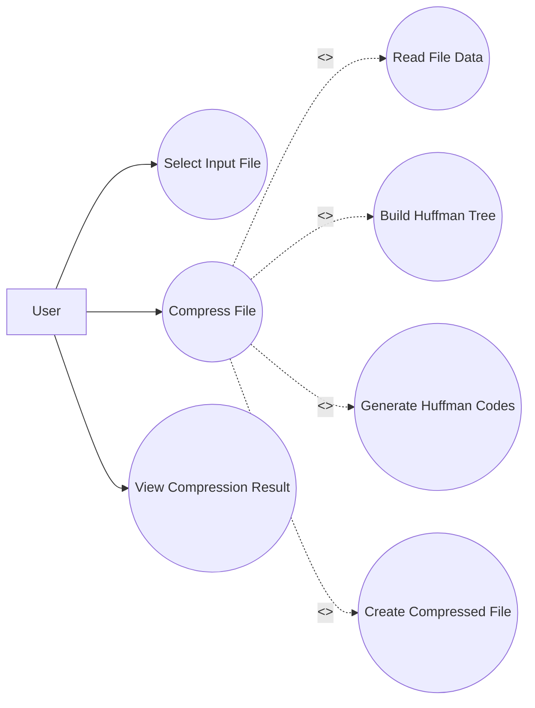
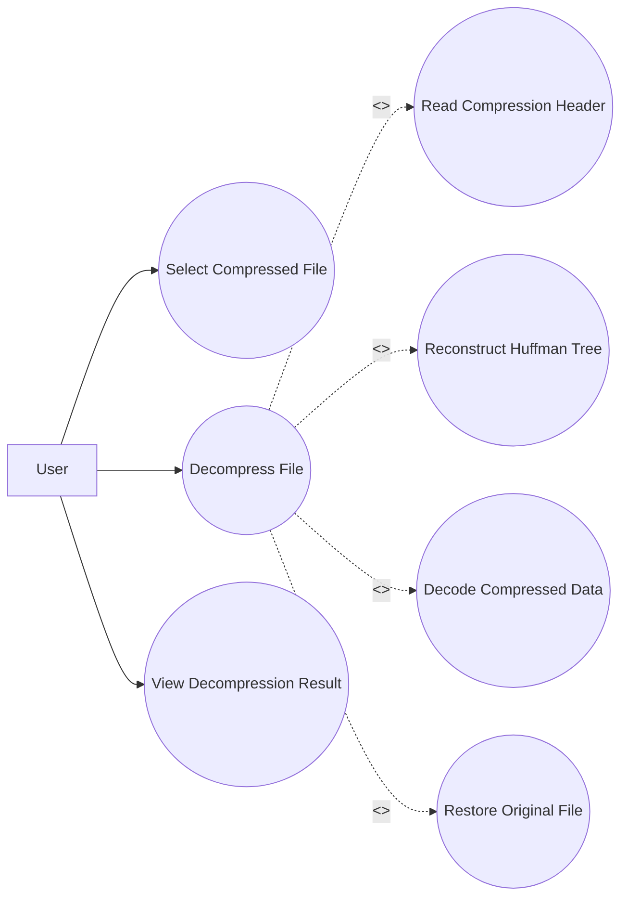

# SRS — Problem 17

## Task 7 — UML Use-Case Diagrams

### Decompression

## Task 8 — RTM
The RTM maps functional requirements, non-functional requirements and security requirements to design modules and test cases.

See the formatted SRS Task 7 & 8 document in this folder.